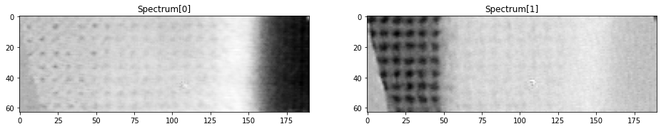
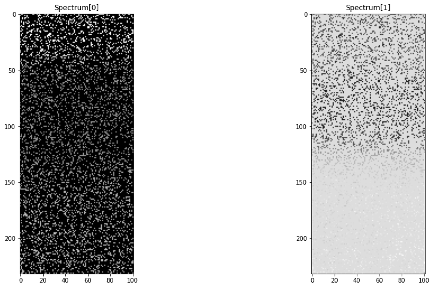
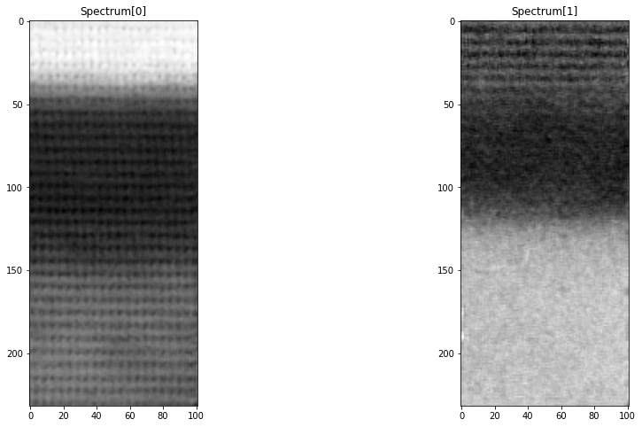
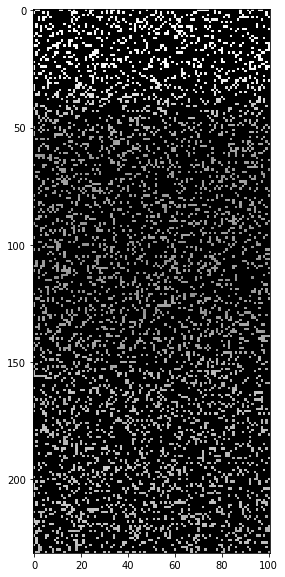
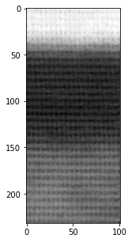

# EELS Image Inpainting

This is the repository for team 8 of the ISAE-Supaero Hackathon (March 2020), subject 4: Unsupervised Electron Energy Loss Spectroscopy (EELS) images inpainting be Deep Neural Network.

This subject is motivated by the high noise and sample damaging inherent to EELS method. 
The objective is to obtained the result of an EELS from a partially sampled version, incomplete and possbly noisy.

Some methods have already been proposed in this [paper](https://arxiv.org/abs/2002.01225).
This project aims at transfering [deep image prior method](https://dmitryulyanov.github.io/deep_image_prior) method for RGB images inpainting to EELS images. 

## Exploration

To explore the deep prior method, the following EELS image has been considered.
Because EELS images are constitute of 1600 channels, a PCA has been ran on the images.
Here are the two main components of the original image.

Randomly selected 80% of the pixels has been removed from the image to simulate a partially sampled one. 
From this, a CNN has been trained to reconstruct the original image.

Here is the reconstitution obtained: 

## Aviris
Some Satellites images have also been tested.
Originial:

20%:

Reconstituted:

## Test

To test our implementation, a CNN has been trained on a test image containing 20% of the pixels without knowing the original image.
Here are the two main component of the image:

Here is the result:

Without the PCA, here is the sum of the channels and the result:

  
  

